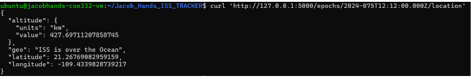
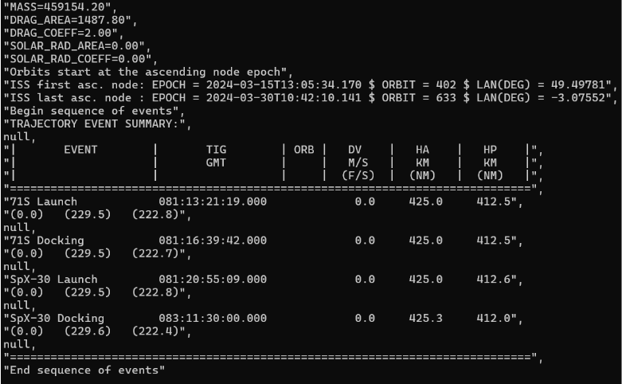
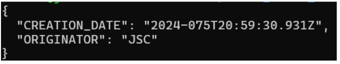

# ISS Tracker

## Project Objective

Building off of homeworks 4 & 5, the objective of the project is to create a Flask-based application to track the real-time position, velcoity, and location of the International Space Station (ISS). The data is provided real-time through the NASA's public data repository that is then parsed, to output Flask app routes.

## Contents

- `Dockerfile`: Defines the environment for containerizing the Python script.
- `docker-compose.yml`: Docker Compose configuration file.
- `iss_tracker.py`: Main Python script for tracking and analyzing ISS data.
- `requirements.txt`: Specifies the required Python packages.
- `test/`: Directory containing unit tests.
  - `test_iss_tracker.py`: Unit tests for testing the functionality of `iss_tracker.py`.
- `diagram.drawio.png`: Software diagram representing components of the project.
- `README.md`: Instructions and information about the project.
- `Images/`: Directory containing images used for the README.md.

## Instructions

### 1. Accessing the Data

The ISS data is retrieved from NASA's public data repository. To access the data, you can use the following URL: [ISS Data](https://nasa-public-data.s3.amazonaws.com/iss-coords/current/ISS_OEM/ISS.OEM_J2K_EPH.xml). This URL provides an XML file containing the ISS coordinates and velocity information. In the file, ISS state vectors in the Mean of J2000 (J2K) reference frame are listed at four-minute intervals spanning a total length of 15 days.

### 2. Building the Container or Running Directly 

### 2.1 Building a Docker container

To build the Docker container for the ISS Tracker, follow these steps:

1. Make sure you have Docker installed on your system. If not, download and install Docker from [the official Docker website](https://docs.docker.com/get-docker/).

2. Navigate to the directory containing the `Dockerfile` and the Python scripts (`iss_tracker.py` and `test_iss_tracker.py`) using the terminal or command prompt command `cd`.

3. Run the following command to build the Docker image and get the Flask app running in the background:

   ```bash
   docker-compose up -d
   ```

   This command builds the Docker image `iss_tracker` with the tag `latest` and runs it in the background.

4. Wait for Docker to complete the build process. Use docker `docker ps -a` to ensure that the `iss_tracker` container is running on port 5000.

The Flask app is now ready to use. You can confirm that it was built successfully by running `docker images` to list all available images on your system.

### 2.1.1 Building Your Own Docker Container 

To build your own container 
```bash
   docker build -t <your_username>/iss_tracker:<version> .
   ```

Then 
```bash
docker run -it --rm -p 5000:5000 <your_username>/iss_tracker:<version>
```
Your Docker container should be running if done correctly 

### 2.2 Running Application Directly

To run the application directly type in the terminal 
 ```bash
   flask --app iss_tracker --debug run
   ```

### 3. Running Unit Tests on the Docker Container

If you wish to run unit tests to ensure the functions in the script work, you can run the following command to access the container's shell:

```bash
docker exec -it iss_tracker /bin/bash
```

After the unit tests are done running, you can exit the container's bash shell by typing exit or pressing Ctrl+D.

### 4. Accessing the Routes

Once the Docker container is running, you can access various routes in the ISS Tracker app using `curl` commands. The routes below enable you to interact with different aspects of the ISS Tracker app and retrieve relevant information. Here are the available routes and their descriptions:


#### 4.1. `/now`

- **Method**: GET
- **Description**: Returns information about the closest epoch to the current time, along with the instantaneous speed and geoposition.


#### 4.2. `/epochs`

- **Method**: GET
- **Description**: Returns the entire dataset.

#### 4.3. `/epochs?limit=int&offset=int`

- **Method**: GET
- **Description**: Returns a modified list of Epochs given query parameters `limit` and `offset`. It allows you to retrieve a subset of the data.

#### 4.4. `/epochs/<epoch>`

- **Method**: GET
- **Description**: Returns state vectors for a specific Epoch from the data set. It provides information about the position and velocity at that particular epoch.

#### 4.5. `/epochs/<epoch>/speed`

- **Method**: GET
- **Description**: Returns the instantaneous speed for a specific Epoch in the data set. It provides the magnitude of the velocity vector at the given epoch.

#### 4.6. `/epochs/<epoch>/location`

- **Method**: GET
- **Description**: Returns latitude, longitude, altitude, and geoposition for a specific Epoch in the data set. Note that geoposition may return "Address Not Found". Oftentimes, this happens if the ISS is over an ocean at the specified epoch, as the GeoPy library does not return an address if that is the case.

#### 4.7. `/comment`

- **Method**: GET
- **Description**: Returns the 'comment' list object from the ISS data.

#### 4.8. `/header`

- **Method**: GET
- **Description**: Returns the 'header' dictionary object from the ISS data.

#### 4.9. `/metadata`

- **Method**: GET
- **Description**: Returns the 'metadata' dictionary object from the ISS data.

These routes provide comprehensive access to the ISS Tracker app's functionalities and data.

### 5. Stopping the application

Do not forget to stop and remove the container once you are done interacting with the Flask microservice using:

```bash
docker-compose down
```

You can make sure the container has been stopped and removed by running:

```bash
docker ps -a
```

This process ensures resource efficiency and prevents conflicts in subsequent container executions.

## Interpreting the Output

The outputs range from speed or position, to the altitude, latitude, and longitude. The outputs from the app route are labeled and allow for understandability about the ISS tajectory. 

## Acknowledgments

The ISS Tracker project utilizes data provided by NASA's public data repository. The README content, comments in the code, and unit test examples were created with the assistance of ChatGPT, an AI language model developed by OpenAI. The geodetic calculations were verfied by an [online tracker](https://www.n2yo.com/?s=90027).